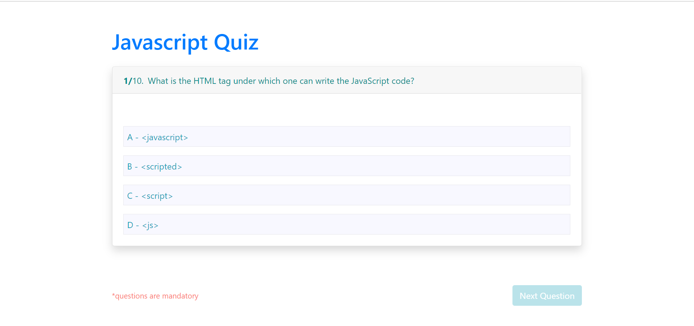

# Quiz Application

> Quiz application using React, React router and redux-toolkit.

## Follow to run application

Clone repository locally by running command

```Js
git clone https://github.com/akhtarvahid/quiz-app.git
```

Navigate to the app folder -> `quiz-app` .asdf

```Js
cd quiz-app
```

Install dependencies

```Js
npm install
```

Start application 

```Js
npm start
```


## Demo

*Quiz*


*Answer Selected*


*Result*
